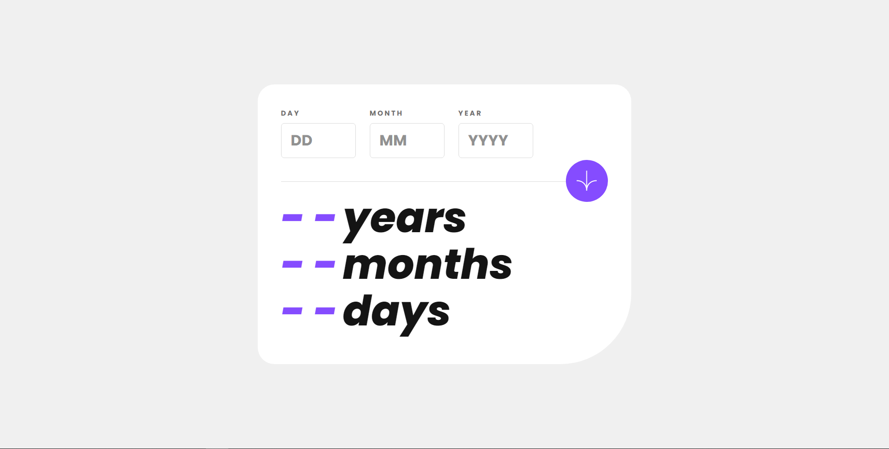
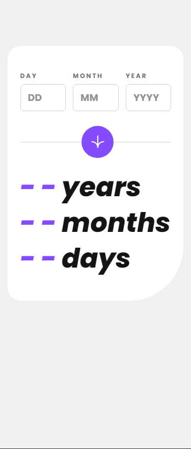

# Frontend Mentor - Age calculator app solution

This is a solution to the [Age calculator app challenge on Frontend Mentor](https://www.frontendmentor.io/challenges/age-calculator-app-dF9DFFpj-Q). Frontend Mentor challenges help you improve your coding skills by building realistic projects. 

## Table of contents

- [Overview](#overview)
  - [The challenge](#the-challenge)
  - [Screenshot](#screenshot)
  - [Links](#links)
- [My process](#my-process)
  - [Built with](#built-with)
  - [What I learned](#what-i-learned)
  - [Continued development](#continued-development)
  - [Useful resources](#useful-resources)
- [Author](#author)

## Overview

- Age calculator application for desktop and mobile. Calculates age from the birthdate till current date.
- Working - The user inputs the value then clicks submit button then the ANSWER/OUTPUT/The total age is printed in 0->number animation.
- Output consists of Year,Month and Day. 
- Used HTML,CSS,JS.

### The challenge

Users should be able to:

- View an age in years, months, and days after submitting a valid date through the form
- Receive validation errors if:
  - Any field is empty when the form is submitted
  - The day number is not between 1-31
  - The month number is not between 1-12
  - The year is in the future
  - The date is invalid e.g. 31/04/1991 (there are 30 days in April)
- View the optimal layout for the interface depending on their device's screen size
- See hover and focus states for all interactive elements on the page
- **Bonus**: See the age numbers animate to their final number when the form is submitted

### Screenshot




### Links

- Solution URL: [solution URL](https://github.com/Netero03/Age-calculator-app)
- Live Site URL: [live site URL](https://netero03.github.io/Age-calculator-app/)

## My process

- Html elements in a required sequence.
- How the application should work.
- Applied logic.
- Applied my javascript knowledge.
- Output correction.
- After output is constant and equal on various values with 100% accuracy.
- Next was Printing error.
- correct Error correction.
- Applied CSS properties.
- After finishing desktop design applied media query and made mobile design.
- Checked working throughout.
- Done.  

### Built with

- Semantic HTML5 markup
- CSS custom properties
- ES6 
- JS

### What I learned

- I learned many things while doing this challenge/project.
 - Learned to use new css properties.
 - To how to do compact coding.
 - Learned that I need to make code more readable and understand able to other people.
 - Learned to work more nice with javascript.
 - Learned new terms in javascript.

```html
<h1>Some HTML code I'm proud of</h1>
```
```css
.inputs input[type="number"]::-webkit-inner-spin-button,
.inputs input[type="number"]::-webkit-outer-spin-button {
      -webkit-appearance: none;
      margin: 0;
    }
```
```js
let currentNumber1 = 0;
    let currentNumber2 = 0;
    let currentNumber3 = 0;
    const targetNumber1 = yearcal; // Change this to your desired ending number
    const targetNumber2 = monthcal;
    const targetNumber3 = daycal;
    const intervalDuration = 25; // Animation interval in milliseconds

    function updateNumber1() {
      yearsold.textContent = currentNumber1;
      currentNumber1++;
      if (currentNumber1 > targetNumber1) {
        clearInterval(animationInterval1);
      }
    }
    function updateNumber2() {
      monthsold.textContent = currentNumber2;
      currentNumber2++;
      if (currentNumber2 > targetNumber2) {
        clearInterval(animationInterval2);
      }
    }
    function updateNumber3() {
      daysold.textContent = currentNumber3;
      currentNumber3++;
      if (currentNumber3 > targetNumber3) {
        clearInterval(animationInterval3);
      }
    }

    const animationInterval1 = setInterval(updateNumber1, intervalDuration);
    const animationInterval2 = setInterval(updateNumber2, intervalDuration);
    const animationInterval3 = setInterval(updateNumber3, intervalDuration);
```

### Continued development

- I'll try to make things more compact and clean. 
- Learn new properties and working with libraries. 
- I'll continue to develop clean and functionable code.

### Useful resources

- Internet

## Author

- Frontend Mentor - [@Netero03](https://www.frontendmentor.io/profile/yourusername)
- Twitter - [@Netero2003](https://www.twitter.com/Netero2003?s=09)

